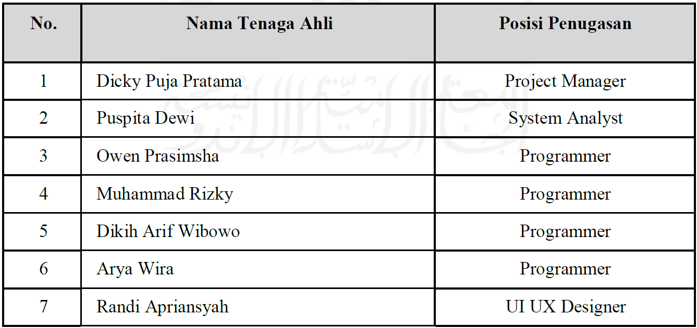
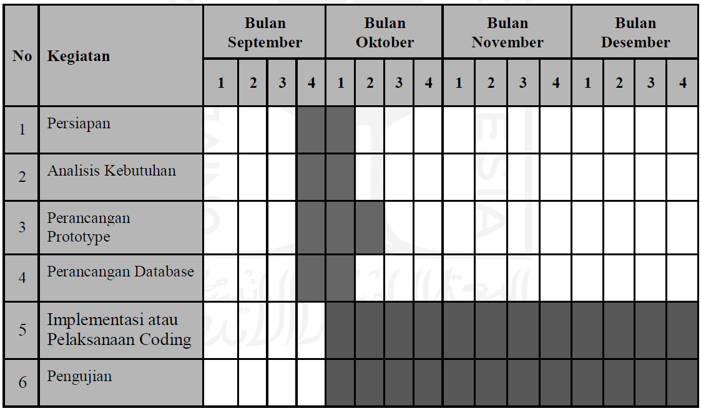
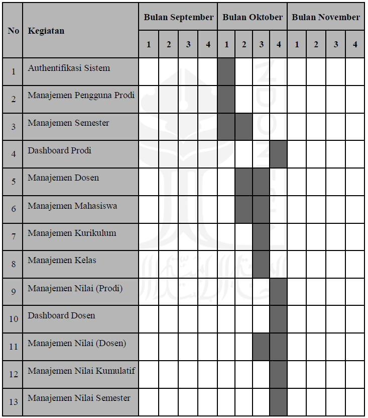

# Project Management Tools' Tutorial: Asana & Focalboard

## Asana

Dibangun oleh Dustin Moskovitz dan Justin Rosenstein pada tahun 2008, Asana merupakan salah satu perangkat lunak *Project Management* yang cukup populer saat ini. Asana berguna untuk membantu perusahaan atau sebuah tim untuk mengorganisasi, melacak, dan mengatur setiap proyek yang mereka miliki. 

### Pros and Cons
Pros:
1. Freemium
2. Dapat diunduh pada PC maupun ponsel.
3. Fitur Peoplelogic.ai + yang dapat membantu mengotomatisasi *insights*, rekomendasi, dan laporan dari penggunaan asana oleh tim proyek. 

Cons:
1. Fitur yang cukup rumit untuk pemula.
2. Jumlah proyek yang dapat dibentuk terbatas (untuk fitur gratis).
3. Tidak cocok untuk tugas sederhana atau tim yang berukuran kecil.

#### Dokumentasi
Untuk mengetahui lebih lanjut terkait dokumentasi dari penggunaan Asana, sila tekan tombol [di sini](https://github.com/sheardclears/Project-Managements-Tools/blob/535cad9fd6e3499739f838780a35c555a0f242be/Files/Dokumentasi%20Asana.pdf).

## Focalboard

Focalboard adalah salah satu *project management* yang open source dan self-hosted yang merupakan alternatif untuk Trello, Notion, dan Asana. Perangkat lunak ini membantu menentukan, mengatur, melacak, dan mengelola pekerjaan individu dan tim dalam suatu proyek.

### Pros and Cons
Pros:
1. Open source dan self-hosted.
2. Mudah digunakan.
3. Jumlah proyek yang dapat dibentuk tidak terbatas.

Cons:
1. Fitur belum cukup lengkap (contohnya seperti belum adanya fitur untuk menugaskan sebuah peran pada salah satu anggota tim).
2. Tidak dapat digunakan pada ponsel.
3. Belum ada fitur penggunaan *artificial intelligence*.

#### Dokumentasi
Untuk mengetahui lebih lanjut terkait dokumentasi dari penggunaan Focalboard, sila tekan tombol [di sini](https://github.com/sheardclears/Project-Managements-Tools/blob/535cad9fd6e3499739f838780a35c555a0f242be/Files/Dokumentasi%20Focalboard.pdf).

# Studi Kasus
Judul: [Manajemen Proyek Pengembangan Sistem Informasi (Studi Kasus: Sistem Penilaian CPL Informatika UII)](https://dspace.uii.ac.id/handle/123456789/29689)

Studi kasus ini berisikan sebuah manajemen proyek terkait dengan proyek Sistem Penilaian CPL Informatika di Universitas Islam Indonesia dengan tim beranggotakan sebagai berikut:

Dalam pelaksanaan proyek, dibentuk sebuah jadwal pengerjaan sebagai bentuk manajemen proyek.

Studi Kasus ini diimplementasikan pada kedua perangkat. 
1. [Asana](https://github.com/sheardclears/Project-Management-Tools/blob/776b71d9d729f552dad0c9748cb611f9f22278ee/Files/Studi%20Kasus%20-%20Asana.pdf)
2. [Focalboard]
